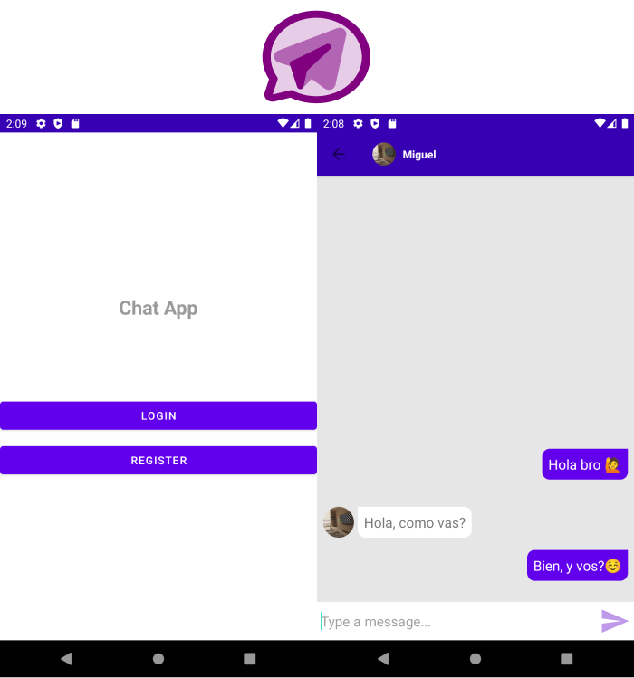

# :zap: Chat App with Authentication using firebase

App creada usando [Android studio](https://developer.android.com/) y [firebase](https://firebase.google.com/docs).

## :page_facing_up: Tabla de contenidos

* [Información general](#general-info)
* [Screenshots](#screenshots)
* [Technologías](#technologias)
* [Disposición](#Disposición)
* [Inspiración](#inspiración)
* [Contacto](#contacto)

## :books: Información general

#Funcionamiento
* Dentro de la app el usuario puede:
* Registrarse
* Iniciar sesión
* Configurar perfil (foto de perfil)
* Ver usuarios registrados.
* Ver chats.
* Enviar y recibir mensajes.
* Enviar y recibir emojis.
* Cerrar sesión

## :camera: Screenshots

## :signal_strength: Tecnologías

* [Android Studio 4.1](https://developer.android.com/)
* [Java 8](https://www.oracle.com/index.html)
* [Gradle](https://gradle.org/)
* [Firebase](https://firebase.google.com/docs)

## Video explicativo del desarrollo

* [IR](https://youtu.be/zCsxU5hkg3M)

## :youtube: Video demostrativo de funcioanmiento

* [IR](https://youtu.be/zv4eFSXESL8)

## :floppy_disk: Disposición

* Descargar APK

## 📦 APK

* [Descargar](https://epnecuador-my.sharepoint.com/:u:/g/personal/miguel_jurado_epn_edu_ec/EVxZ90ZPQ4dJmMnm0ryp0wwBiMm_8DR0LMqSVxR44iA88g?e=3TtGBN)

## :clap: Inspiración

* Proyecto inspirado en [KOD Dev - Chat App with Firebase Android Studio Tutorials](https://www.youtube.com/playlist?list=PLzLFqCABnRQftQQETzoVMuteXzNiXmnj8)

## Responsabilidades de cada integrante

* [!Integrantes](./tmp/actividades.JPG)

## :envelope: Contacto 

* Proyecto desarrollado por [Freddy Valverde [GitHub](https://github.com/FreddyJR1995), Miguel - 0988185518]
